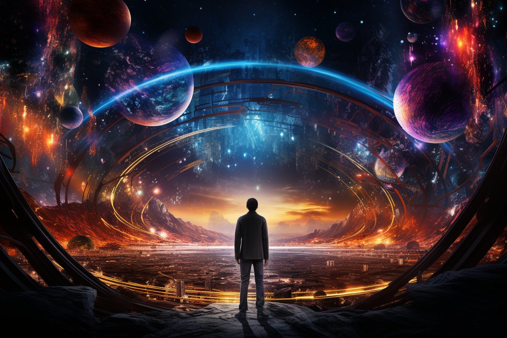

# Embarking on a Quantum Journey

## Introducing Quantum Voyagers: Secrets of the Quantek

The dawn of the quantum age has brought a myriad of questions, innovations, and possibilities. As we stand on the precipice 
of technological advancement, we invite you to join us on an extraordinary journey. Welcome to "Quantum Voyagers: Secrets 
of the Quantek" – an adventure that marries the thrill of science fiction with the intriguing world of quantum computing.

## What is Quantum Voyagers?

"Quantum Voyagers" is not just a story; it's an exploration. It's a gateway to the complex and fascinating universe of 
quantum physics, brought to life through the lens of fiction. As our characters navigate the mysteries of the Quantek 
civilization, readers will delve into the fundamental principles of quantum computing, error correction, quantum machine 
learning, and more.

## A Journey of Discovery

From the basics of qubits and superposition to advanced topics like quantum error mitigation, "Quantum Voyagers" guides 
readers on a path of understanding and enlightenment. Each chapter is more than a tale – an educational experience accompanied 
by interactive tutorials and real-world examples.

## Meet the Characters and Explore New Worlds

Stay tuned as we introduce the main characters, the intriguing planet they explore, and the state-of-the-art spaceship 
that carries them through the cosmos. The vivid descriptions and engaging narratives will breathe life into a world where 
science meets imagination.

## Join Us!

Are you ready to unravel the secrets of the Quantek? To explore the boundaries of knowledge and soar through the quantum 
realms? Follow us on [Twitter](https://twitter.com/AstroAiLabs) and engage with the [GitHub repository](https://github.com/AstroAI-Labs/quantum-voyagers) 
to stay updated with the latest chapters, tutorials, and more.

Embark on this grand adventure with us. The Quantum Voyagers await!
