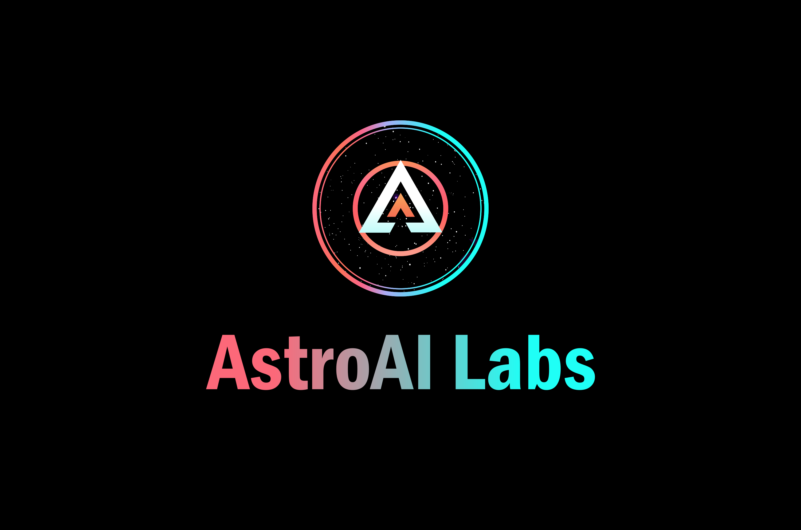

# AstroAI Labs

**Year Established**: 2320  
**Location**: Terra Prima  
**Founding Vision**: To pioneer and lead the frontier of quantum research, technology, and space exploration.

## Description
AstroAI Labs is the epitome of innovation and advancement in quantum technology. Located on Terra Prima, it's a hub that gathers the brightest minds from various disciplines to work on groundbreaking projects.  

With state-of-the-art facilities, AstroAI Labs focuses on areas like quantum computing, quantum machine learning, quantum engineering, and space exploration. Its collaborations extend to global institutions, promoting knowledge sharing and technological growth.

## Key Achievements
- Development of Quantum Pathfinder X9, the ninth model in a series of experimental quantum ships.
- Creation of AI-Xeon, an advanced quantum AI capable of complex quantum computations.
- Pioneering research in quantum entanglement, quantum error correction, and other quantum principles.
- Formation of the Quantum Voyagers team, a specialized group dedicated to exploring the unknown reaches of space and uncovering the secrets of the ancient Quantek civilization.

## Role in the Story
AstroAI Labs is the primary workplace for the main characters in the Quantum Voyagers story. It symbolizes human achievement, curiosity, and the relentless pursuit of knowledge. Its projects and endeavors are central elements within the narrative, connecting various plot points and characters.

## Affiliation
AstroAI Labs has affiliations with major universities, research centers, and governments around the galaxy. Its commitment to ethical practices, environmental sustainability, and scientific excellence makes it a respected and trusted name in the quantum community.
