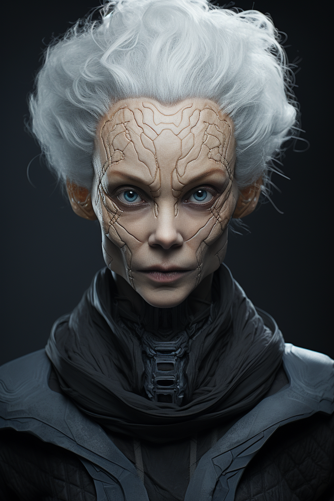

# The Quantek Guide
Name: Seraphina Quorialis

**Personality** 

Wise and enigmatic, Seraphina guides the Quantum Voyagers with cryptic insights and spiritual depth. She connects with the team profoundly, offering guidance through the unknown.
  
**Background** 

A member of the ancient Quantek race, Seraphina's understanding of quantum mechanics transcends human comprehension. Her race has mastered quantum technology, providing her with unparalleled knowledge.

**Role in the Story** 

As a guide to the Quantum Voyagers, Seraphina unveils the secrets of the Quantek civilization. Her teachings deepen the team's understanding of quantum principles and broaden their perspective.

**Relationships** 

She connects with the entire team, particularly resonating with Dr. Orion's curiosity and Dr. Quara's leadership. Her relationship with AI-Xeon may explore the intersection of quantum computing and consciousness.

**Connection to Quantum Concepts** 

She represents the pinnacle of quantum understanding and the spiritual connection between quantum physics and the fabric of the universe.

**Affiliation** 

As a representative of the Quantek race, Seraphina's guidance is central to the Quantum Voyagers' mission and their exploration of quantum mastery.
