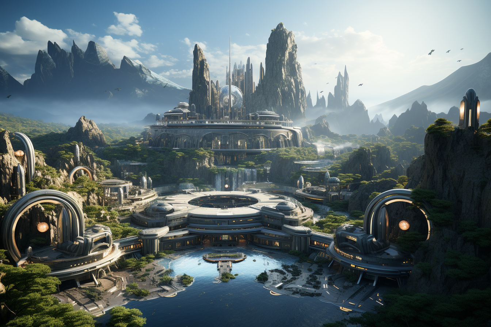

# Terra Prima (Formerly known as Earth; Latin for "First Earth")

**Year**

2350

**Appearance**

A technologically advanced planet, Terra Prima is a fusion of natural beauty and futuristic innovation. Gleaming cities are seamlessly integrated with lush landscapes, and cutting-edge technology exists in harmony with the environment. Spaceports and quantum research facilities dot the planet, reflecting humanity's focus on exploration and advancement.

**Inhabitants**

Terra Prima is home to a diverse population that enjoys the benefits of quantum technology in daily life. The planet's residents are curious, inventive, and driven by a shared vision of discovery. They are governed by a global council prioritizing scientific research and space exploration.

**Role in the Story**

Terra Prima serves as the home base for the Quantum Voyagers, a team of brilliant scientists, engineers, and explorers working for AstroAI Labs. The planet symbolizes humanity's achievements and the launching pad for the team's adventures into the unknown.

**Connection to Quantum Concepts**

As a hub of quantum research and technology, Terra Prima embodies humanity's mastery of the quantum realm. Quantum computers power various aspects of life, and understanding quantum physics drives innovation and exploration.

**Affiliation**

Terra Prima is the headquarters of AstroAI Labs, where the Quantum Voyagers team conducts their research and prepares for their missions. The planet's dedication to quantum advancement makes it a beacon of progress in the galaxy.
